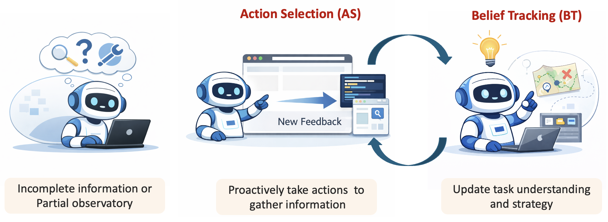
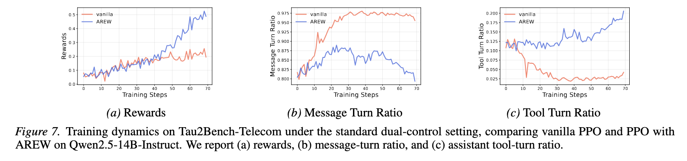

# (ICLR'26 Oral + ICML'26) Learning to Seek and Use Information: Agentic Active Reasoning under Partial Observability

<p align="center">
  <strong>T3 · ICLR 2026 Oral</strong><br>
  <a href="https://arxiv.org/abs/2510.12264">
    
  </a>
  <a href="https://huggingface.co/datasets/WorkingOut/T3_data">
    
  </a>
  <a href="https://x.com/ZouDeyu56610/status/2041531834404852201">
    
  </a>
  <a href="https://www.linkedin.com/feed/update/urn:li:activity:7467929786292596736/">
    
  </a>
  <a href="http://xhslink.com/o/9S66Dkjx5t7">
    
  </a>
</p>

<p align="center">
  <strong>AREW · ICML 2026</strong><br>
  <a href="https://arxiv.org/abs/2603.12109">
    
  </a>
  <a href="https://x.com/ZouDeyu56610/status/2062907794089791952">
    
  </a>
  <a href="https://www.linkedin.com/feed/update/urn:li:activity:7467933746076221441/">
    
  </a>
</p>

This repository is a unified codebase for our research line on **learning to seek and use information under partial observatory** in LLM agents. It includes the official implementations of **T3** (Reducing Belief Deviation in Reinforcement Learning for Active Reasoning of LLM Agents, **ICLR 2026 Oral**) and **AREW** (On Information Self-Locking in Reinforcement Learning for Active Reasoning of LLM Agents, **ICML 2026**).


The two works address a shared problem: in long-horizon interactive reasoning, LLM agents must actively acquire information and maintain an accurate belief state. However, standard outcome-based RL often provides too little structure to learn these coupled abilities. T3 studies how belief deviation can make later trajectory segments uninformative or even harmful for learning, while AREW studies how action selection and belief tracking can mutually mask each other’s learning signal, leading to information self-locking.


This repository contains the core algorithms, data preprocessing, training and evaluation pipelines, and experimental setups for both methods. Beyond reproducing the original papers, we are extending the codebase into a broader platform for studying RL-trained LLM agents in realistic active reasoning, tool-use, and deep-research environments.



## TODOs

- We have applied T3 and AREW to tau2-bench and release the code and results in this repo. Refer to this section: [Applicability to General Agentic Scenarios](#applicability-to-general-agentic-scenarios). Results on the effectiveness of T3 and AREW over Deep-Research and SWE settings will be released.

## Table of Contents

- [TODOs](#todos)
- [Environment Setup](#environment-setup)
- [Data Preparation](#data-preparation)
- [Training](#training)
- [Evaluation and Reproduction](#evaluation-and-reproduction)
- [Applicability to General Agentic Scenarios](#applicability-to-general-agentic-scenarios)
- [Extending the Repository](#extending-the-repository)
- [Repository Structure](#repository-structure)
- [Citation](#citation)


## Environment Setup

The packaged code lives under `verl/`, so installation is done from that subdirectory.

```bash
python3 -m venv .venv
source .venv/bin/activate
pip install --upgrade pip
pip install -e ./verl
```

For the broader dependency set used by the bundled `verl` fork:

```bash
pip install -r verl/requirements.txt
```

Notes: the following is the version of key packages in the environment we are currently using:

```
- Python 3.11
- PyTorch 2.7.1
- vLLM 0.10.1
- Ray 2.10.0.19
- Transformers 4.55.4
- flash-attn 2.8.0.post2
- accelerate 1.10.1
```


## Data Preparation

The released preprocessing scripts write parquet files in the format expected by `main_ppo.py`. The dataset (parquet formats) can be found [here](https://huggingface.co/datasets/WorkingOut/T3_data).

### 1. CircuitDecoding

Default raw file location:

```text
<workspace>/CircuitDecoding/cd_raw_2_circuits_<cand>_cand.jsonl
```

Conversion:

```bash
python3 verl/preprocess/data_process/cd.py \
  --local_dir /path/to/workspace
```

This produces:

- `CircuitDecoding/train__cand_20.parquet`
- `CircuitDecoding/val__cand_20.parquet`

The script also supports `--input_file`, `--train_size`, `--val_size`, `--train_output`, and `--val_output`.

### 2. MovieRec

Default raw file location:

```text
<workspace>/MovieRec/mr_seen_10_un_10_attr_8.jsonl
```

Conversion:

```bash
python3 verl/preprocess/data_process/mr.py \
  --local_dir /path/to/workspace
```

This produces:

- `MovieRec/train_seen_10_un_10_attr_8_variant.parquet`
- `MovieRec/val_seen_10_un_10_attr_8_variant.parquet`

The script also supports overriding the input path, output path, split sizes, `data_source`, and controller variant.

### 3. Tau2Bench

Tau2Bench data is generated from the task definitions under `verl/search_r1/tau2_adapter/`.

**Solo-mode** example:

```bash
python3 verl/preprocess/data_process/tau2.py \
  --local_dir /path/to/workspace \
  --domain telecom \
  --train_split train \
  --val_split test \
  --enable_think \
  --think_mode short
```

This writes parquet files under:

```text
/path/to/workspace/Tau2Bench/telecom/
```

If you need filenames aligned with a specific training wrapper, set `--train_output` and `--val_output`, or override `TRAIN_FILE` and `VAL_FILE` when launching training.

**Standard-mode** example with an LLM-simulated user:

```bash
python3 verl/preprocess/data_process/tau2.py \
  --local_dir /path/to/workspace \
  --domain telecom \
  --source_split full \
  --exclude_splits test \
  --custom_split_name full_minus_test \
  --train_ratio 0.9 \
  --seed 42 \
  --mode standard \
  --enable_think \
  --think_mode short
```

This produces standard-mode files such as (the following two files are public in [here](https://huggingface.co/datasets/WorkingOut/T3_data).):

- `Tau2Bench/telecom/train_full_minus_test_9009_standard_think_short.parquet`
- `Tau2Bench/telecom/val_full_minus_test_9009_standard_think_short.parquet`

## Training

### Core Entry Point

The canonical entry point is:

```bash
python3 -m verl.trainer.main_ppo ...
```

The example scripts under `verl/cmd/` are thin wrappers around this command.

For CircuitDecoding and MovieRec, we provide T3 implementation. For Tau2Bench, we provide both T3 and AREW implementation.

### 1. CircuitDecoding

```bash
bash verl/cmd/cd/ppo.sh
```

Key environment overrides:

- `PROJECT_ROOT`
- `DATA_DIR`
- `BASE_MODEL`
- `OUTPUT_ROOT`
- `NUM_GPUS`
- `TRAIN_FILE`
- `VAL_FILE`

### 2. MovieRec

```bash
bash verl/cmd/mrv/ppo.sh
```

The structure is the same as CircuitDecoding, with MovieRec-specific default parquet names.

### 3. Tau2Bench

For **solo** mode,

```bash
bash verl/cmd/tau2/ppo1.1.sh  # This is for the solo-mode.
```

- `verl/cmd/tau2/ppo.sh` for a PPO-style baseline
- `verl/cmd/tau2/ppo1.1.sh` and related variants for T3-enabled settings
- `verl/cmd/tau2/ppo1.2.sh` and related variants for AREW-enabled settings

For Tau2Bench **standard** mode with an LLM-simulated user:

```bash
export TAU2_STANDARD_USER_API_KEY=...
export TAU2_STANDARD_USER_AZURE_ENDPOINT=...

bash verl/cmd/tau2s/ppo.sh
bash verl/cmd/tau2s/ppo_AREW.sh
```

The `tau2s` scripts default to Qwen2.5-14B-Instruct and the standard telecom think-short parquet files. `ppo.sh` is the vanilla PPO baseline. `ppo_AREW.sh` reproduces the v427 Tau2-standard AREW setup: targeted labels, `step_abs_sum`, `AREW_BONUS_SCALE=50.0`, `tau2_arew_min_turn=6`, and `early_cut=false`.

## Evaluation and Reproduction

Evaluation is run through the same PPO entry point in validation-only mode, eg,

```bash
bash verl/cmd/cd/eval.sh
```

The script merges FSDP checkpoints to Hugging Face format before validation.

## Applicability to General Agentic Scenarios

T3 is intended to be applicable beyond a single benchmark or environment family. 

### 1. Tau2Bench

Many thanks to https://github.com/sierra-research/tau2-bench!

We evaluate on Tau2Bench-Telecom, a multi-turn tool-use benchmark where the agent must resolve realistic customer-service tickets by interacting with an environment through API-like tools. The repository includes both the **solo** mode setting, where the policy interacts directly with the environment/tool interface, and the **standard** setting, where the policy interacts with an LLM-simulated user while assistant-side tool calls are executed by the backend environment.

For the solo setting, we derive simple step-level signals directly from the online interaction trace: a step is labeled **positive** if it increases the number of matched expected actions in the benchmark evaluator, **negative** if it corresponds to an obvious failure such as a tool error, invalid or malformed action, repeated action, or a write that has no effect, and neutral otherwise. AREW uses these labels to perform within-trajectory advantage redistribution. **T3** uses the same signals for trajectory truncation; in our current Tau2Bench setup we use a conservative soft truncation policy with trunc_strength = 8 and set the hard truncation threshold to 999, which effectively disables hard truncation. See details in `verl/search_r1/tau2_adapter`.

For Tau2-**standard**, we automatically derive weak step-level critiques from the interaction traces between the **agent, tools, and the LLM-simulated user**. **Positive** labels are assigned to steps that **uncover new information, advance task completion, or elicit informative user-side diagnostics**, while **negative** labels are assigned to **invalid, repetitive, or unproductive** behaviors. The resulting labels are transformed into token-level advantage modifiers and incorporated into PPO training as a lightweight auxiliary signal alongside the original outcome reward.

Here are the main experimental results. Weclome to check more experimental analysis and implementation details in the source code and in our paper!

**Solo mode: Comparing vanilla PPO with PPO equipped with T3**

150 steps training on Qwen-2.5-7B


**Solo mode: Comparing vanilla PPO with PPO equipped with AREW**

150 steps training on Qwen-2.5-7B


**Standard mdoe: Comparing vanilla PPO with PPO equipped with AREW**

70 steps training on Qwen-2.5-14B



## Extending the Repository

### Adding a New Dataset

The default data format consumed by `create_rl_dataset()` in `verl/verl/trainer/main_ppo.py` expects records with fields such as:

- `prompt`
- `answer`
- `data_source`
- `ability`
- `reward_model`
- `extra_info`

If the task also needs custom environment metadata or reward-time controller information, include a `controller` field as done by the released T3 datasets.

For non-standard loading logic, you can either:

- emit the same parquet schema used by the existing preprocessing scripts
- provide a custom dataset through `data.custom_cls` in the Hydra config

### Adding a New Interactive Scenario

For example, Tau2-style tasks are organized under `verl/search_r1/tau2_adapter/`. The main extension points are:

- add task data under `verl/search_r1/tau2_adapter/data/domains/<domain>/`
- implement domain environments and tools under `verl/search_r1/tau2_adapter/domains/<domain>/`
- register the environment in `verl/search_r1/tau2_adapter/loader/registry.py`
- keep the rollout contract compatible with `Tau2SoloSpace` in `verl/search_r1/tau2_adapter/space.py`

## Repository Structure

```text
.
├── 8182_Reducing_Belief_Deviation.pdf
├── README.md
└── verl/
    ├── cmd/                     # training and evaluation wrappers
    ├── preprocess/              # data conversion scripts
    ├── search_r1/               # interactive environments and rollout helpers
    └── verl/
        └── trainer/
            ├── main_ppo.py
            └── ppo/ray_trainer.py
```

## Citation

If you use this repository, please cite the T3 and AREW paper. If your use also depends on the underlying framework components, please additionally cite `verl`.

```bibtex
@inproceedings{zoureducing,
  title={Reducing Belief Deviation in Reinforcement Learning for Active Reasoning of LLM Agents},
  author={Zou, Deyu and Chen, Yongqiang and Wang, Jianxiang and YANG, Garry and Li, Mufei and Da, Qing and Cheng, James and Li, Pan and Gong, Yu},
  booktitle={The Fourteenth International Conference on Learning Representations}
}
```

```
@article{zou2026information,
  title={On Information Self-Locking in Reinforcement Learning for Active Reasoning of LLM agents},
  author={Zou, Deyu and Chen, Yongqiang and Feng, Fan and Li, Mufei and Li, Pan and Gong, Yu and Cheng, James},
  journal={arXiv preprint arXiv:2603.12109},
  year={2026}
}
```
